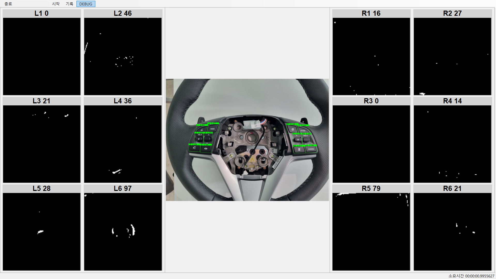
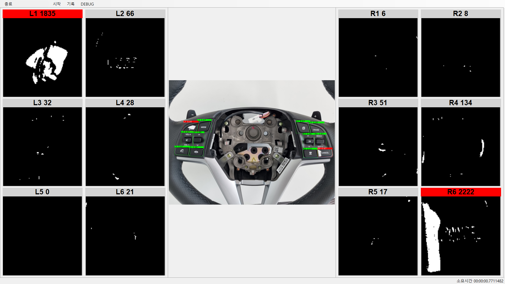
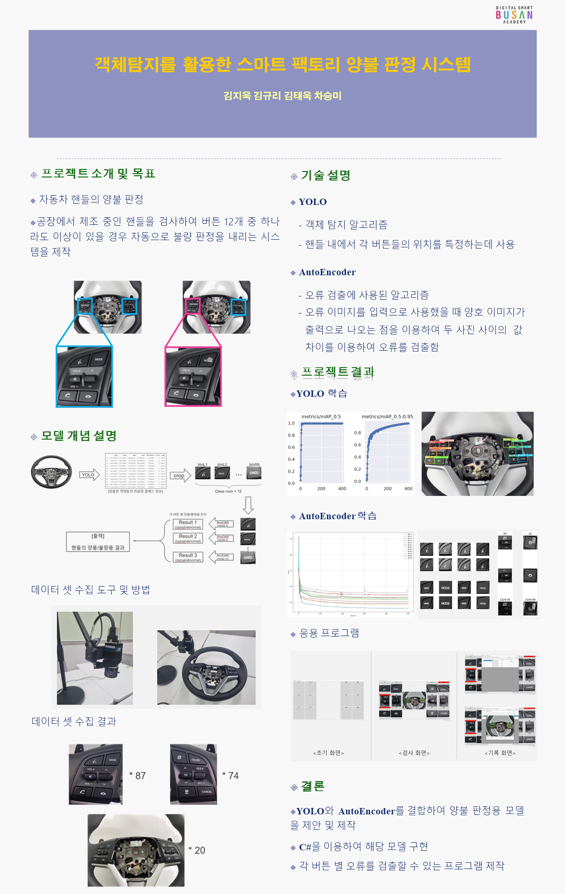

# Anomaly Detector
> 이상치 탐지를 위해 이미지 객체 탐지와 AutoEncoder를 이용한 불량 탐지 어플리케이션  
![csharp][csharp-image]
[![ml.net][ml.net-image]][ml.net-url]
[![emgu][opencv-image]][emgu-url]

OpenCV의 NET과 ML.NET를 이용하여 ONNX 모델을 불러와 객체 탐지 및 이미지의 이상을 탐지합니다. 이상치 탐지 결과를 Mysql에 저장하고 불러올 수 있습니다.

* OpenCV
  * Yolo v5
  * AutoEncoder
* ML.NET
  * AutoEncoder with skip connections
* MYSQL

  

## Tensorflow > ONNX 로 변환

[Jupyter Notebooks](notebooks/tf2onnx.ipynb)

## 참고자료

Yolo  
https://github.com/RoudyES/Darknet-Yolov4-EmguCV  
https://github.com/doleron/yolov5-opencv-cpp-python  

ML.NET  
https://vkontech.com/making-predictions-in-c-with-a-pre-trained-tensorflow-model-via-onnx/#Previewing_the_Model_in_Netron  
https://stackoverflow.com/questions/69554649/onnxruntime-using-and-sklearn-svmregressor-in-net

AutoEncoder with Skip connections  
https://sensibilityit.tistory.com/517  
https://towardsdatascience.com/using-skip-connections-to-enhance-denoising-autoencoder-algorithms-849e049c0ac9

<!-- Markdown link & img dfn's -->
[csharp-image]: https://img.shields.io/badge/.NET-512BD4?style=flat-square&logo=dotnet&logoColor=white
[ml.net-image]: https://img.shields.io/badge/ML.NET-239120?style=flat-square&logo=dotnet&logoColor=white
[ml.net-url]: https://dotnet.microsoft.com/en-us/apps/machinelearning-ai/ml-dotnet
[opencv-image]: https://img.shields.io/badge/Emgu%20CV-EA7E20?style=flat-square&logo=opencv&logoColor=white
[emgu-url]: https://www.emgu.com/